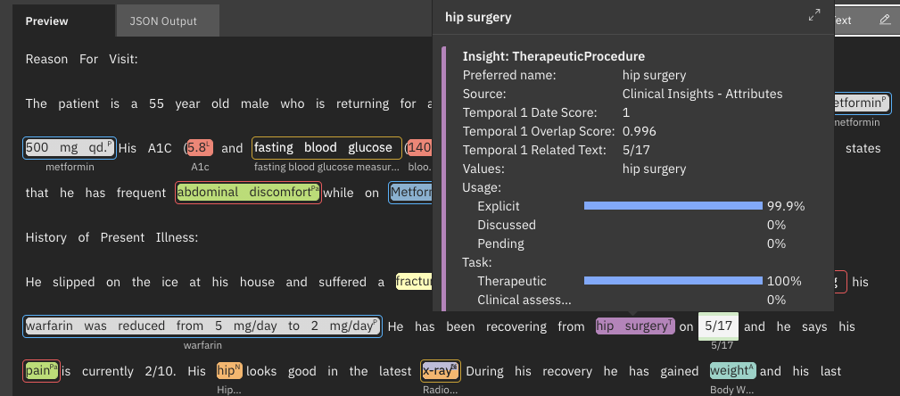

<!-- ---

copyright:
  years: 2020
lastupdated: "2020-10-28"

keywords: annotator clinical data, clinical data, annotation, temporal

subcollection: wh-acd

--- -->

<!-- # Temporal Overview (Preview) -->

Annotator for Clinical Data can detect temporal expressions and link them to related concepts as contextual features. This temporal capability is currently available through [Clinical Insights](/clouddocs/clinical_insights_overview/).  

The Annotator for Clinical Data [demo application](https://acd-try-it-out.mybluemix.net/preview) allows you to see how temporal linking works.  In the screenshot below, hovering over _hip surgery_ shows that is linked to the date _5/17_.



Concepts are linked to dates by JSON structures described below.

## temporal

| Feature | Description |
|:--------|:------------|
| begin | The start position of the temporal entity as a character offset into the text.  The smallest possible start position is 0. |
| end | The end position of the temporal entity as a character offset into the text. The end position points at the first character after the annotation, such that end-begin equals the length of the coveredText. |
| temportalType | Provides information about the type of a temporal entity.  Currently, _dateScore_ is the only score provided in this section.  Anything that scores sufficiently low as a date will not be surfaced.  For example, in the image above _2/10_ in the context of the patient's current pain level scores low as a date and is not surfaced. |
| relationType | Provides information about how the temporal entity relates to an entity.  Currently, _overlapsScore_ is the only relation type defined and it indicates how strongly the temporal entity is linked to the concept. |

Temporal features

```
"begin": 585,
"end": 596,
"coveredText": "hip surgery",
"negated": false,
"insightModelData": {
     "procedure": {
         "usage": {
             "explicitScore": 0.999,
             "pendingScore": 0,
             "discussedScore": 0
         },
         "task": {
             "therapeuticScore": 1,
             "diagnosticScore": 0,
             "labTestScore": 0,
             "surgicalTaskScore": 0,
             "clinicalAssessmentScore": 0
         },
         "type": {
             "deviceScore": 0,
             "materialScore": 0,
             "medicationScore": 0,
             "procedureScore": 1,
             "conditionManagementScore": 0
         }
     }
 },
 "temporal": [
     {
         "begin": 600,
         "end": 604,
         "coveredText": "5/17",
         "temporalType": {
             "dateScore": 1
         },
         "relationTypes": {
             "overlapsScore": 0.996
         }
     }
 ]
```

It is possible for multiple temporal links to be added to a concept.  For example, given the following text:

_PMH: Patient had bariatric revision surgery in April 1999 and again in July 2003, knee replacement in 2011, and underwent arthroscopic surgery on her shoulder in 2016._

The temporal section for _revision surgery_ would have two associated dates.

```
"temporal": [{
		"begin": 47,
		"end": 57,
		"coveredText": "April 1999",
		"temporalType": {
			"dateScore": 1
		},
		"relationTypes": {
			"overlapsScore": 0.988
		}
	},
	{
		"begin": 71,
		"end": 80,
		"coveredText": "July 2003",
		"temporalType": {
			"dateScore": 1
		},
		"relationTypes": {
			"overlapsScore": 0.923
		}
	}
]
```
