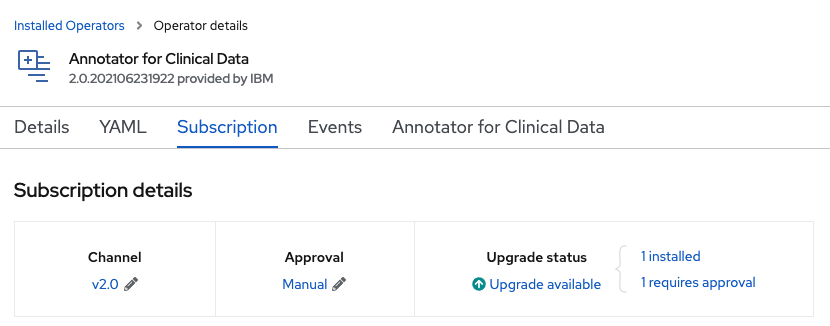

_Note:  The upgrade path only applies to IBM Watson Annotator for Clinical Data Container Edition at this time. Upgrades will be available for Merative Annotator for Clinical Data Container Edition sometime after the initial Merative version is published._

The Annotator for Clinical Data Container Edition supports both manual and automatic upgrades of the operator and operand through [Operator Lifecycle Manager (OLM)](https://docs.openshift.com/container-platform/4.7/operators/understanding/olm/olm-understanding-olm.html#olm-overview_olm-understanding-olm) integration. OLM operators are limited to upgrades and do not rollback function. An operator upgrade is always done with a new replacement version. Operand upgrades are managed by the operator. An ACD instance is upgraded based on a specific set of related images that align with the ACD operator version.

## Upgrade paths

There is no upgrade from IBM Watson ACD to Merative ACD. See the [Migration](/migration/considerations/) section for details. The update graph for Merative ACD will be provided when available. The major and minor version for ACD continues to be `2.0`. New function and fixes are released as patch versions made available as part of a continuous delivery strategy. Refer here for a list of the [prior IBM Watson ACD versions](https://github.com/merative/acd-containers/blob/master/CHANGELOG.md#releases-from-ibm).

## Automatic upgrades

With OLM integration, at operator install time, a subscription is created to an upgrade channel. The channel defines the stream of upgrades available for an operator and is used to roll out the upgrades for channel subscribers.

At the present time, the ACD operator only provides one channel, `v2.0`. When a new patch version becomes available within that channel, i.e. `v2.0.202109011707`, the operator will automatically reconcile the new version and use a rolling update strategy to upgrade both the operator and ACD instance, creating new pods with the new version installed before terminating the pods running the old versions.

## Manual upgrades

To manually upgrade, a project administrator must review and approve the manual install plan for the new version. Once approved, the resources for the new version will be created in order to satisfy the requirements for the components specified in the plan.

To review and approve a manual upgrade of ACD through the OpenShift Container Platform web console, do the following:

1. Log in to the OpenShift Container Platform [web console](https://docs.openshift.com/container-platform/4.7/web_console/web-console.html) using your login credentials.
1. Expand the **Operators** dropdown and select **Installed Operators**.
1. Expand the **Project** dropdown and select the correct project where the ACD operator is already installed.
1. Click the **Annotator for Clinical Data** link to open the operator details panel.
1. Click the **Subscription** tab to open the subscription details panel.
1. Click the **Upgrade available** link to open the InstallPlan details panel.
1. Click the **Preview InstallPlan** button to inspect the requirements for the components specified in this InstallPlan before approving.
1. Click the **Approve** button to approve the manual install plan and begin the upgrade.

## How do I know when an upgrade is available for an operator?

You can inspect the status of your ACD operator's subscription to know if an update is available. The value associated with the currentCSV field is the newest version that is known to OLM, and installedCSV is the version that is installed on the cluster.

When using the web console, the operator status will also show `Upgrade available`, and `1 requires approval` if the approval strategy is set to Manual, as shown here.

