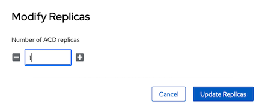

The replica count in the ACD deployment determines the number of replicas for each of the ACD deployments, which determines the peak concurrent capacity of the ACD deployment.  If the capacity is exceeded, the system will start to queue up requests to protect the container processes from overload.  If the queues fill up, the system will return errors to the caller indicating the system is not available.  To adjust the workload capacity, ACD deployment instances can be horizontally scaled by adjusting the replica count in the custom resource definition of the instance.
In the namespace of the ACD instance, under Installed Operators, in the console find the ACD operator.  In the ACD operator details, select the Annotator for Clinical Data tab to show the ACD instance and click the name of the `acd-instance` to bring up the Details view of the ACD instance. On the Replicas field, click the pencil icon and adjust the number up or down as needed:

**Note:** Ensure you have enough capacity on the worker nodes in the cluster to support the number of replicas chosen.  Each replica consumes approximately 64 GB of memory across all of the deployment pods and there needs to be room for non-disruptive rolling updates.
