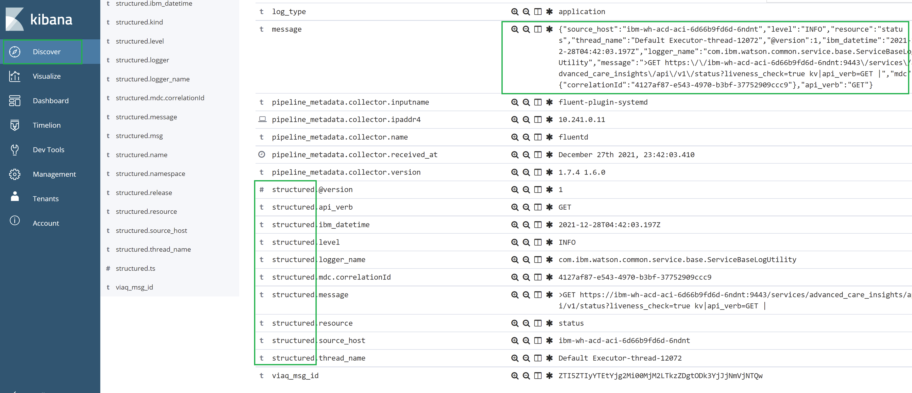
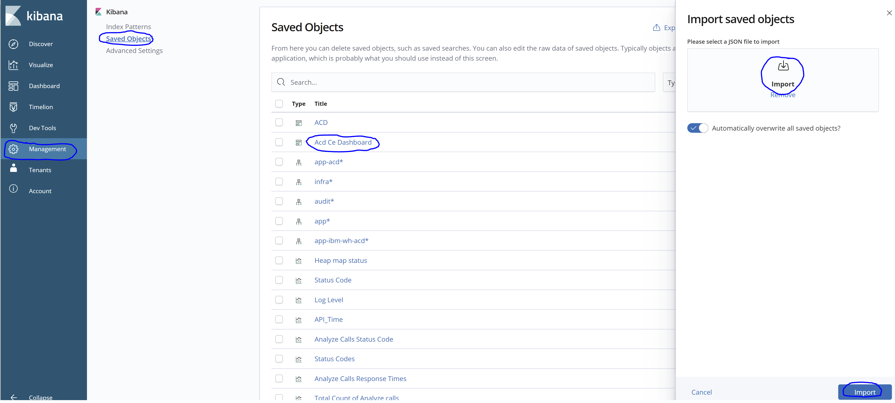

You can monitor status or troubleshoot issues with your installation in the following ways:

* View the ACD logs by configuring a logging dashboard
* View pod status and logs
* Log in to a pod to investigate its status

## Configuring a Logging Dashboard

Openshift supports many solutions for collection and visualization of logs.  Below  are several examples that illustrate the views required for monitoring and debugging ACD deployments.

### A Note About Tenant and Correlation Identifiers in ACD Logs

ACD outputs its log entries as JSON objects.  Of special note within the JSON structure is the "mdc" object which generally contains two keys.

* correlationId: a UUID used to correlate all log entries for an ACD invocation across all annotators.  This can be helpful in performing root cause analysis when problems occur.
* tenantId:  The unique identifier for a specific tenant if ACD is being utilized in a multi-tenant manner.  In a single tenant environment it will always be "defaultTenant".

### Using the Openshift Cluster Logging Operator

The Openshift cluster logging operator allows for deploying an Elasticsearch, Fluentd, Kibana (EFK) stack to collect and visualize logs from applications.  Due to the preconfigured nature of the EFK components, the sample views for ACD are limited to basic string queries using Kibana's Lucene query syntax.  For instructions on setting up the logging operator itself, see the [Openshift documentation](https://docs.openshift.com/container-platform/latest/logging/cluster-logging.html) for your Openshift release.

View | Lucene Query
----------------------------|-----------------------------
All ACD logs  | `kubernetes.container_name:ibm-wh-acd-*`
All non-status API calls| `kubernetes.container_name:"ibm-wh-acd-acd" AND "api_time" NOT "\"resource\"\:\"status\""`
ALL Analyze API calls | `kubernetes.container_name:"ibm-wh-acd-acd" AND "\"resource\":\"analyze\"" AND "\"api_verb\":\"POST\""`
ACD 5XX responses |   `kubernetes.container_name:"ibm-wh-acd-acd" AND "\"api_rc\":500" OR "\"api_rc\"\:501" OR "\"api_rc\"\:503" OR "\"api_rc\"\:504"`
ACD 4XX responses (user errors)  | `kubernetes.container_name:"ibm-wh-acd-acd" AND "\"api_rc\":400" OR "\"api_rc\"\:403" OR "\"api_rc\"\:404" OR "\"api_rc\"\:409" OR "\"api_rc\"\:413"`
ACD runtime exceptions | `kubernetes.container_name:"ibm-wh-acd-*" AND exception`

* To filter out logs for automated verification testing that occurs during pod startup, add `NOT  "\"correlationId\"\:\"junit-*"` to the query string.
* If your cluster contains multiple deployments of ACD in different namespaces, add `AND kubernetes.namespace_name:"<namespace>"` to view the logs for only one deployment.
* To view logs filtered by correlationId, include `"\"correlationId\":\"<correlation_id>\""`.
* In a multi-tenant ACD depoyment, add `"\"tenantId\":\"<tenant_id>\""` to see only log entries related to a specific tenant.

### Enabling JSON logging for Openshift Conatiner Platform

*Prerequisites
1.Access to Red Hat Openshift Container Platform
2.In your Openshift project, Make sure that you install below operators.
  a. Red Hat Openshift logging operator
  b. Openshift ElasticSearch operator
  
Logs including JSON logs are usually represented as a string inside the message field. That makes it hard for users to query specific fields inside a JSON document. OpenShift Logging’s Log Forwarding API enables you to parse JSON logs into a structured object and forward them to either OpenShift Logging-managed Elasticsearch or any other third-party system supported by the Log Forwarding API

* You need to ensure that the OpenShift Logging Operator can parse the JSON data correctly. JSON parsing is possible as of version 5.1 of this operator. You only need to deploy a custom ClusterLogForwarder resource. This will overwrite the Fluentd pods and provide the configuration needed to parse JSON logs.
Login to your openshift platform to create cluster log forwarder as shown below 

* As shown in the above image once you choose to create cluster log forwader, select the yaml view radio button and paste the below configuration.

```yaml clusterlogforwarder.yaml
apiVersion: logging.openshift.io/v1
kind: ClusterLogForwarder
metadata:
  name: instance
  namespace: openshift-logging
spec:
  outputDefaults:
    elasticsearch:
      structuredTypeKey: kubernetes.labels.app_kubernetes_io/part-of
  pipelines:
    - inputRefs:
        - application
      outputRefs:
        - default
      parse: json
```

* structuredTypeKey (string, optional) is the name of a message field. The value of that field, if present, is used to construct the index name.
* The value of structuredTypeKey prefixes with "kubernetes.labels.key". In this case the value of "key" is "app_kubernetes_io/part-of".
* In the above snippet of code we are making use of structuredTypeKey to create index in Kibana. The new index will be created as app-{app_kubernetes_io/part-of}.
* In the above case the value of "app_kubernetes_io/part-of" is "ibm-wh-acd". The index will be created as "app-ibm-wh-acd".
* Once the new index is created using the custom log forwarder, Login to Kibana and create the index pattern with the name matching as app-ibm-wh-acd-* as shown below 
* Once you browse to the dicsover screen select the index pattern you created above and you will be able to find the logs inside message fields coverted to JSON prefixed as "structured" fields as shown in the below 
* As the logs are now converted to JSON you can use the fields in the visualizations/dashboards as per the requirement.
* Here is the Custom Dashboard that can be useful to analyze your data.

```json Acd_ce_dashboard.json
[
  {
    "_id": "1bc00b00-72f4-11ec-8b80-f979ac279214",
    "_type": "dashboard",
    "_source": {
      "title": "ACD CE Dashboard",
      "hits": 0,
      "description": "",
      "panelsJSON": "[{\"gridData\":{\"x\":0,\"y\":0,\"w\":24,\"h\":15,\"i\":\"1\"},\"version\":\"6.8.1\",\"panelIndex\":\"1\",\"type\":\"visualization\",\"id\":\"41c2c050-5782-11ec-b7f6-83b6c3cdab1d\",\"embeddableConfig\":{}},{\"gridData\":{\"x\":24,\"y\":0,\"w\":24,\"h\":15,\"i\":\"2\"},\"version\":\"6.8.1\",\"panelIndex\":\"2\",\"type\":\"visualization\",\"id\":\"4273e080-5785-11ec-b7f6-83b6c3cdab1d\",\"embeddableConfig\":{}},{\"gridData\":{\"x\":0,\"y\":15,\"w\":24,\"h\":15,\"i\":\"3\"},\"version\":\"6.8.1\",\"panelIndex\":\"3\",\"type\":\"visualization\",\"id\":\"3197dbc0-5787-11ec-b7f6-83b6c3cdab1d\",\"embeddableConfig\":{}},{\"gridData\":{\"x\":24,\"y\":15,\"w\":24,\"h\":15,\"i\":\"4\"},\"version\":\"6.8.1\",\"panelIndex\":\"4\",\"type\":\"visualization\",\"id\":\"a735b160-578a-11ec-b7f6-83b6c3cdab1d\",\"embeddableConfig\":{}},{\"gridData\":{\"x\":0,\"y\":30,\"w\":24,\"h\":15,\"i\":\"5\"},\"version\":\"6.8.1\",\"panelIndex\":\"5\",\"type\":\"visualization\",\"id\":\"050ed340-5784-11ec-b7f6-83b6c3cdab1d\",\"embeddableConfig\":{}}]",
      "optionsJSON": "{\"darkTheme\":false,\"useMargins\":true,\"hidePanelTitles\":false}",
      "version": 1,
      "timeRestore": false,
      "kibanaSavedObjectMeta": {
        "searchSourceJSON": "{\"query\":{\"query\":\"\",\"language\":\"lucene\"},\"filter\":[]}"
      }
    }
  },
  {
    "_id": "41c2c050-5782-11ec-b7f6-83b6c3cdab1d",
    "_type": "visualization",
    "_source": {
      "title": "Analyze Calls Status Code",
      "visState": "{\"title\":\"Analyze Calls Status Code\",\"type\":\"line\",\"params\":{\"addLegend\":true,\"addTimeMarker\":false,\"addTooltip\":true,\"categoryAxes\":[{\"id\":\"CategoryAxis-1\",\"labels\":{\"show\":true,\"truncate\":100},\"position\":\"bottom\",\"scale\":{\"type\":\"linear\"},\"show\":true,\"style\":{},\"title\":{},\"type\":\"category\"}],\"grid\":{\"categoryLines\":false,\"style\":{\"color\":\"#eee\"}},\"legendPosition\":\"right\",\"seriesParams\":[{\"data\":{\"id\":\"1\",\"label\":\"Count\"},\"drawLinesBetweenPoints\":true,\"mode\":\"normal\",\"show\":\"true\",\"showCircles\":true,\"type\":\"line\",\"valueAxis\":\"ValueAxis-1\"}],\"times\":[],\"type\":\"line\",\"valueAxes\":[{\"id\":\"ValueAxis-1\",\"labels\":{\"filter\":false,\"rotate\":0,\"show\":true,\"truncate\":100},\"name\":\"LeftAxis-1\",\"position\":\"left\",\"scale\":{\"mode\":\"normal\",\"type\":\"linear\"},\"show\":true,\"style\":{},\"title\":{\"text\":\"Count\"},\"type\":\"value\"}]},\"aggs\":[{\"id\":\"1\",\"enabled\":true,\"type\":\"count\",\"schema\":\"metric\",\"params\":{}},{\"id\":\"2\",\"enabled\":true,\"type\":\"date_histogram\",\"schema\":\"segment\",\"params\":{\"field\":\"@timestamp\",\"timeRange\":{\"from\":\"now-24h\",\"to\":\"now\",\"mode\":\"quick\"},\"useNormalizedEsInterval\":true,\"interval\":\"auto\",\"drop_partials\":false,\"customInterval\":\"2h\",\"min_doc_count\":1,\"extended_bounds\":{}}},{\"id\":\"3\",\"enabled\":true,\"type\":\"range\",\"schema\":\"group\",\"params\":{\"field\":\"structured.api_rc\",\"ranges\":[{\"from\":200,\"to\":299},{\"from\":400,\"to\":499},{\"from\":500,\"to\":599}]}}]}",
      "uiStateJSON": "{}",
      "description": "",
      "version": 1,
      "kibanaSavedObjectMeta": {
        "searchSourceJSON": "{\"index\":\"8cd1f950-4899-11ec-b7f6-83b6c3cdab1d\",\"query\":{\"language\":\"lucene\",\"query\":\"\"},\"filter\":[{\"$state\":{\"store\":\"appState\"},\"meta\":{\"alias\":null,\"disabled\":true,\"formattedValue\":\"200 to 299\",\"index\":\"8cd1f950-4899-11ec-b7f6-83b6c3cdab1d\",\"key\":\"structured.api_rc\",\"negate\":true,\"params\":{\"gte\":200,\"lt\":299},\"type\":\"range\",\"value\":\"200 to 299\"},\"range\":{\"structured.api_rc\":{\"gte\":200,\"lt\":299}}},{\"$state\":{\"store\":\"appState\"},\"meta\":{\"alias\":null,\"disabled\":true,\"formattedValue\":\"400 to 499\",\"index\":\"8cd1f950-4899-11ec-b7f6-83b6c3cdab1d\",\"key\":\"structured.api_rc\",\"negate\":true,\"params\":{\"gte\":400,\"lt\":499},\"type\":\"range\",\"value\":\"400 to 499\"},\"range\":{\"structured.api_rc\":{\"gte\":400,\"lt\":499}}},{\"meta\":{\"index\":\"8cd1f950-4899-11ec-b7f6-83b6c3cdab1d\",\"negate\":false,\"disabled\":false,\"alias\":\"Analyze Calls\",\"type\":\"phrase\",\"key\":\"structured.resource\",\"value\":\"analyze/*\",\"params\":{\"query\":\"analyze/*\",\"type\":\"phrase\"}},\"query\":{\"match\":{\"structured.resource\":{\"query\":\"analyze/*\",\"type\":\"phrase\"}}},\"$state\":{\"store\":\"appState\"}}]}"
      }
    },
    "_migrationVersion": {
      "visualization": "6.7.2"
    }
  },
  {
    "_id": "050ed340-5784-11ec-b7f6-83b6c3cdab1d",
    "_type": "visualization",
    "_source": {
      "title": "Status Codes",
      "visState": "{\"title\":\"Status Codes\",\"type\":\"line\",\"params\":{\"addLegend\":true,\"addTimeMarker\":false,\"addTooltip\":true,\"categoryAxes\":[{\"id\":\"CategoryAxis-1\",\"labels\":{\"show\":true,\"truncate\":100},\"position\":\"bottom\",\"scale\":{\"type\":\"linear\"},\"show\":true,\"style\":{},\"title\":{},\"type\":\"category\"}],\"grid\":{\"categoryLines\":false,\"style\":{\"color\":\"#eee\"}},\"legendPosition\":\"right\",\"seriesParams\":[{\"data\":{\"id\":\"1\",\"label\":\"Count\"},\"drawLinesBetweenPoints\":true,\"mode\":\"normal\",\"show\":\"true\",\"showCircles\":true,\"type\":\"line\",\"valueAxis\":\"ValueAxis-1\"}],\"times\":[],\"type\":\"line\",\"valueAxes\":[{\"id\":\"ValueAxis-1\",\"labels\":{\"filter\":false,\"rotate\":0,\"show\":true,\"truncate\":100},\"name\":\"LeftAxis-1\",\"position\":\"left\",\"scale\":{\"mode\":\"normal\",\"type\":\"linear\"},\"show\":true,\"style\":{},\"title\":{\"text\":\"Count\"},\"type\":\"value\"}]},\"aggs\":[{\"id\":\"1\",\"enabled\":true,\"type\":\"count\",\"schema\":\"metric\",\"params\":{}},{\"id\":\"2\",\"enabled\":true,\"type\":\"date_histogram\",\"schema\":\"segment\",\"params\":{\"field\":\"@timestamp\",\"timeRange\":{\"from\":\"now-24h\",\"mode\":\"quick\",\"to\":\"now\"},\"useNormalizedEsInterval\":true,\"interval\":\"auto\",\"drop_partials\":false,\"customInterval\":\"2h\",\"min_doc_count\":1,\"extended_bounds\":{}}},{\"id\":\"3\",\"enabled\":true,\"type\":\"range\",\"schema\":\"group\",\"params\":{\"field\":\"structured.api_rc\",\"ranges\":[{\"from\":400,\"to\":499},{\"from\":500,\"to\":599}]}}]}",
      "uiStateJSON": "{}",
      "description": "",
      "version": 1,
      "kibanaSavedObjectMeta": {
        "searchSourceJSON": "{\"index\":\"8cd1f950-4899-11ec-b7f6-83b6c3cdab1d\",\"query\":{\"language\":\"lucene\",\"query\":\"\"},\"filter\":[{\"$state\":{\"store\":\"appState\"},\"meta\":{\"alias\":null,\"disabled\":true,\"formattedValue\":\"200 to 299\",\"index\":\"8cd1f950-4899-11ec-b7f6-83b6c3cdab1d\",\"key\":\"structured.api_rc\",\"negate\":true,\"params\":{\"gte\":200,\"lt\":299},\"type\":\"range\",\"value\":\"200 to 299\"},\"range\":{\"structured.api_rc\":{\"gte\":200,\"lt\":299}}},{\"$state\":{\"store\":\"appState\"},\"meta\":{\"alias\":null,\"disabled\":true,\"formattedValue\":\"400 to 499\",\"index\":\"8cd1f950-4899-11ec-b7f6-83b6c3cdab1d\",\"key\":\"structured.api_rc\",\"negate\":true,\"params\":{\"gte\":400,\"lt\":499},\"type\":\"range\",\"value\":\"400 to 499\"},\"range\":{\"structured.api_rc\":{\"gte\":400,\"lt\":499}}},{\"$state\":{\"store\":\"appState\"},\"meta\":{\"alias\":\"Analyze Calls\",\"disabled\":true,\"index\":\"8cd1f950-4899-11ec-b7f6-83b6c3cdab1d\",\"key\":\"structured.resource\",\"negate\":false,\"params\":{\"query\":\"analyze/*\",\"type\":\"phrase\"},\"type\":\"phrase\",\"value\":\"analyze/*\"},\"query\":{\"match\":{\"structured.resource\":{\"query\":\"analyze/*\",\"type\":\"phrase\"}}}}]}"
      }
    },
    "_migrationVersion": {
      "visualization": "6.7.2"
    }
  },
  {
    "_id": "4273e080-5785-11ec-b7f6-83b6c3cdab1d",
    "_type": "visualization",
    "_source": {
      "title": "Analyze Calls Response Times",
      "visState": "{\"title\":\"Analyze Calls Response Times\",\"type\":\"line\",\"params\":{\"type\":\"line\",\"grid\":{\"categoryLines\":false,\"style\":{\"color\":\"#eee\"}},\"categoryAxes\":[{\"id\":\"CategoryAxis-1\",\"type\":\"category\",\"position\":\"bottom\",\"show\":true,\"style\":{},\"scale\":{\"type\":\"linear\"},\"labels\":{\"show\":true,\"truncate\":100},\"title\":{}}],\"valueAxes\":[{\"id\":\"ValueAxis-1\",\"name\":\"LeftAxis-1\",\"type\":\"value\",\"position\":\"left\",\"show\":true,\"style\":{},\"scale\":{\"type\":\"linear\",\"mode\":\"normal\"},\"labels\":{\"show\":true,\"rotate\":0,\"filter\":false,\"truncate\":100},\"title\":{\"text\":\"Average structured.api_time\"}}],\"seriesParams\":[{\"show\":\"true\",\"type\":\"line\",\"mode\":\"normal\",\"data\":{\"label\":\"Average structured.api_time\",\"id\":\"1\"},\"valueAxis\":\"ValueAxis-1\",\"drawLinesBetweenPoints\":true,\"showCircles\":true},{\"show\":true,\"mode\":\"normal\",\"type\":\"line\",\"drawLinesBetweenPoints\":true,\"showCircles\":true,\"data\":{\"id\":\"3\",\"label\":\"Max API Time\"},\"valueAxis\":\"ValueAxis-1\"},{\"show\":true,\"mode\":\"normal\",\"type\":\"line\",\"drawLinesBetweenPoints\":true,\"showCircles\":true,\"data\":{\"id\":\"4\",\"label\":\"Min API Time\"},\"valueAxis\":\"ValueAxis-1\"}],\"addTooltip\":true,\"addLegend\":true,\"legendPosition\":\"right\",\"times\":[],\"addTimeMarker\":false},\"aggs\":[{\"id\":\"1\",\"enabled\":true,\"type\":\"avg\",\"schema\":\"metric\",\"params\":{\"field\":\"structured.api_time\"}},{\"id\":\"2\",\"enabled\":true,\"type\":\"date_histogram\",\"schema\":\"segment\",\"params\":{\"field\":\"@timestamp\",\"timeRange\":{\"from\":\"now-24h\",\"to\":\"now\",\"mode\":\"quick\"},\"useNormalizedEsInterval\":true,\"interval\":\"auto\",\"drop_partials\":false,\"customInterval\":\"2h\",\"min_doc_count\":1,\"extended_bounds\":{}}},{\"id\":\"3\",\"enabled\":true,\"type\":\"max\",\"schema\":\"metric\",\"params\":{\"field\":\"structured.api_time\",\"customLabel\":\"Max API Time\"}},{\"id\":\"4\",\"enabled\":true,\"type\":\"min\",\"schema\":\"metric\",\"params\":{\"field\":\"structured.api_time\",\"customLabel\":\"Min API Time\"}}]}",
      "uiStateJSON": "{}",
      "description": "",
      "version": 1,
      "kibanaSavedObjectMeta": {
        "searchSourceJSON": "{\"index\":\"8cd1f950-4899-11ec-b7f6-83b6c3cdab1d\",\"query\":{\"query\":\"\",\"language\":\"lucene\"},\"filter\":[{\"meta\":{\"index\":\"8cd1f950-4899-11ec-b7f6-83b6c3cdab1d\",\"negate\":false,\"disabled\":false,\"alias\":null,\"type\":\"phrase\",\"key\":\"structured.resource\",\"value\":\"analyze/*\",\"params\":{\"query\":\"analyze/*\",\"type\":\"phrase\"}},\"query\":{\"match\":{\"structured.resource\":{\"query\":\"analyze/*\",\"type\":\"phrase\"}}},\"$state\":{\"store\":\"appState\"}}]}"
      }
    },
    "_migrationVersion": {
      "visualization": "6.7.2"
    }
  },
  {
    "_id": "3197dbc0-5787-11ec-b7f6-83b6c3cdab1d",
    "_type": "visualization",
    "_source": {
      "title": "Total Count of Analyze calls",
      "visState": "{\"title\":\"Total Count of Analyze calls\",\"type\":\"line\",\"params\":{\"type\":\"line\",\"grid\":{\"categoryLines\":false,\"style\":{\"color\":\"#eee\"}},\"categoryAxes\":[{\"id\":\"CategoryAxis-1\",\"type\":\"category\",\"position\":\"bottom\",\"show\":true,\"style\":{},\"scale\":{\"type\":\"linear\"},\"labels\":{\"show\":true,\"truncate\":100},\"title\":{}}],\"valueAxes\":[{\"id\":\"ValueAxis-1\",\"name\":\"LeftAxis-1\",\"type\":\"value\",\"position\":\"left\",\"show\":true,\"style\":{},\"scale\":{\"type\":\"linear\",\"mode\":\"normal\"},\"labels\":{\"show\":true,\"rotate\":0,\"filter\":false,\"truncate\":100},\"title\":{\"text\":\"Count\"}}],\"seriesParams\":[{\"show\":\"true\",\"type\":\"line\",\"mode\":\"normal\",\"data\":{\"label\":\"Count\",\"id\":\"1\"},\"valueAxis\":\"ValueAxis-1\",\"drawLinesBetweenPoints\":true,\"showCircles\":true}],\"addTooltip\":true,\"addLegend\":true,\"legendPosition\":\"right\",\"times\":[],\"addTimeMarker\":false},\"aggs\":[{\"id\":\"1\",\"enabled\":true,\"type\":\"count\",\"schema\":\"metric\",\"params\":{}},{\"id\":\"2\",\"enabled\":true,\"type\":\"date_histogram\",\"schema\":\"segment\",\"params\":{\"field\":\"@timestamp\",\"useNormalizedEsInterval\":true,\"interval\":\"auto\",\"drop_partials\":false,\"customInterval\":\"2h\",\"min_doc_count\":1,\"extended_bounds\":{}}}]}",
      "uiStateJSON": "{}",
      "description": "",
      "version": 1,
      "kibanaSavedObjectMeta": {
        "searchSourceJSON": "{\"index\":\"8cd1f950-4899-11ec-b7f6-83b6c3cdab1d\",\"query\":{\"query\":\"\",\"language\":\"lucene\"},\"filter\":[{\"meta\":{\"index\":\"8cd1f950-4899-11ec-b7f6-83b6c3cdab1d\",\"negate\":false,\"disabled\":false,\"alias\":null,\"type\":\"phrase\",\"key\":\"structured.resource\",\"value\":\"Analyze\",\"params\":{\"query\":\"Analyze\",\"type\":\"phrase\"}},\"query\":{\"match\":{\"structured.resource\":{\"query\":\"Analyze\",\"type\":\"phrase\"}}},\"$state\":{\"store\":\"appState\"}},{\"meta\":{\"index\":\"8cd1f950-4899-11ec-b7f6-83b6c3cdab1d\",\"negate\":false,\"disabled\":false,\"alias\":null,\"type\":\"exists\",\"key\":\"structured.api_rc\",\"value\":\"exists\"},\"exists\":{\"field\":\"structured.api_rc\"},\"$state\":{\"store\":\"appState\"}}]}"
      }
    },
    "_migrationVersion": {
      "visualization": "6.7.2"
    }
  },
  {
    "_id": "a735b160-578a-11ec-b7f6-83b6c3cdab1d",
    "_type": "visualization",
    "_source": {
      "title": "Analyze Call Request Size",
      "visState": "{\"title\":\"Analyze Call Request Size\",\"type\":\"line\",\"params\":{\"type\":\"line\",\"grid\":{\"categoryLines\":false,\"style\":{\"color\":\"#eee\"}},\"categoryAxes\":[{\"id\":\"CategoryAxis-1\",\"type\":\"category\",\"position\":\"bottom\",\"show\":true,\"style\":{},\"scale\":{\"type\":\"linear\"},\"labels\":{\"show\":true,\"truncate\":100},\"title\":{}}],\"valueAxes\":[{\"id\":\"ValueAxis-1\",\"name\":\"LeftAxis-1\",\"type\":\"value\",\"position\":\"left\",\"show\":true,\"style\":{},\"scale\":{\"type\":\"linear\",\"mode\":\"normal\"},\"labels\":{\"show\":true,\"rotate\":0,\"filter\":false,\"truncate\":100},\"title\":{\"text\":\"Sum of structured.api_size_i\"}}],\"seriesParams\":[{\"show\":\"true\",\"type\":\"line\",\"mode\":\"normal\",\"data\":{\"label\":\"Sum of structured.api_size_i\",\"id\":\"1\"},\"valueAxis\":\"ValueAxis-1\",\"drawLinesBetweenPoints\":true,\"showCircles\":true}],\"addTooltip\":true,\"addLegend\":true,\"legendPosition\":\"right\",\"times\":[],\"addTimeMarker\":false},\"aggs\":[{\"id\":\"1\",\"enabled\":true,\"type\":\"sum\",\"schema\":\"metric\",\"params\":{\"field\":\"structured.api_size_i\"}},{\"id\":\"2\",\"enabled\":true,\"type\":\"date_histogram\",\"schema\":\"segment\",\"params\":{\"field\":\"@timestamp\",\"useNormalizedEsInterval\":true,\"interval\":\"auto\",\"drop_partials\":false,\"customInterval\":\"2h\",\"min_doc_count\":1,\"extended_bounds\":{}}}]}",
      "uiStateJSON": "{}",
      "description": "",
      "version": 1,
      "kibanaSavedObjectMeta": {
        "searchSourceJSON": "{\"index\":\"8cd1f950-4899-11ec-b7f6-83b6c3cdab1d\",\"query\":{\"query\":\"\",\"language\":\"lucene\"},\"filter\":[]}"
      }
    },
    "_migrationVersion": {
      "visualization": "6.7.2"
    }
  }
]
```

Import the acd ce dahsboard as shown below 

### Using IBM Log Analysis on a Red Hat OpenShift on IBM Cloud Cluster (ROKS)

A ROKS cluster can be configured to automatically forward cluster to logs to an instance of the IBM Log Analysis service in the same IBM Cloud account. Instructions for setup can be found in the logging topic of [the ROKS documentation](https://cloud.ibm.com/docs/openshift?topic=openshift-health#openshift_logging).   Once logs are being collected, create the following views for ACD.

View | Log Analysis Query
----------------------------|-----------------------------
All ACD logs  | `app:ibm-wh-acd`
All non-status API calls| `app:ibm-wh-acd api_time:* -resource:status`
ALL Analyze API calls | `app:ibm-wh-acd-acd resource:ANALYZE api_verb:POST`
ACD 5XX Responses |   `app:ibm-wh-acd api_rc:>499`
ACD 4XX Responses (user errors)  | `app:ibm-wh-acd api_rc:>399 api_rc:<500`
ACD runtime exceptions | `app:ibm-wh-acd exception`

* To filter out logs for automated verification testing that occurs during pod startup, add `-mdc.correlationId:junit` to the query string.
* If your cluster contains multiple deployments of ACD in different namespaces, add `namespace:<namespace>` to view the logs for only one deployment.
* To view logs filtered by correlationId, include `mdc.correlationId:<correlation_id>`.
* In a multi-tenant ACD depoyment, add `mdc.tenantId:<tenant_id>` to see only log entries related to a specific tenant.

### Other logging solutions

Other log collection and visualization solutions may be used as long as they can be configured with similar views as described above.  This includes native log solutions in supported clouds as well as forwarding to an external log aggregator using the Openshift Cluster Logging Operator's [log forwarding support](https://docs.openshift.com/container-platform/4.7/logging/cluster-logging-external.html)

## View Pod Status and Logs

All Openshift objects can also be accessed by running the `oc` command-line tool.

To list the objects, run the `oc get` command followed by the types of object to retrieve, for example: pods, services, deployments, or secrets. A useful option is the `-w (watch)` option. The watch option keeps the command in a pending state, showing how the pods change over time. It also follows the pods through the initialization, waiting, and running phases.

An example of `oc get`, to list the names and status of the pods in the specified namespace:

`oc get pods -w -n <namespace>`

When a pod is running, you can read the log of that pod by running the following command:

`oc logs <pod-name> -n <namespace>` where pod-name is the name of the pod you want to query.

You can use the `-f (follow)` option to leave the command open and show the log updating in real time.

## Log in to a Pod

Like any other Docker container when a pod is in running status, you can log in to it to conduct a more detailed investigation. The commands that you use depend on the pod, but the following command should work because bash is generally available:

`kubectl exec -it <pod-name> -n <namespace> /bin/bash`

The command opens a bash session within the pod.
